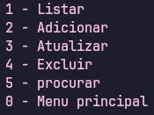

# **SMDI**
a simple program that uses python :D

## Index:
* [The system](#-system)
* 
* 

---

## 👇 system

to run the program use `python Projeto.py` which will show the main menu with the options:

### main menu:

* `student`
* `disciplines`
* `professors`
* `classes`
* `enrollments`
* `leave` (exit of applicaton)

### operation menu:

* `list` (list the registered data)
* `add` (add data to data.json file)
* `update` (update the selected data in json)
* `delete` (delete the selected data)
* `search` (search registered info)
* `main` menu (back to main menu)

---
